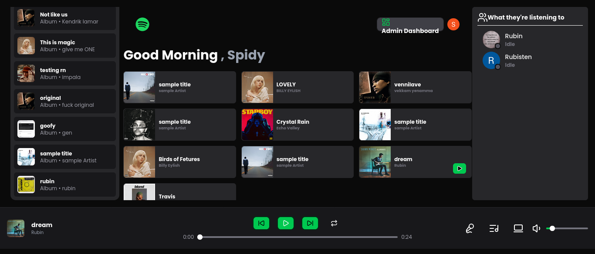
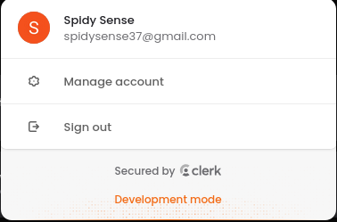
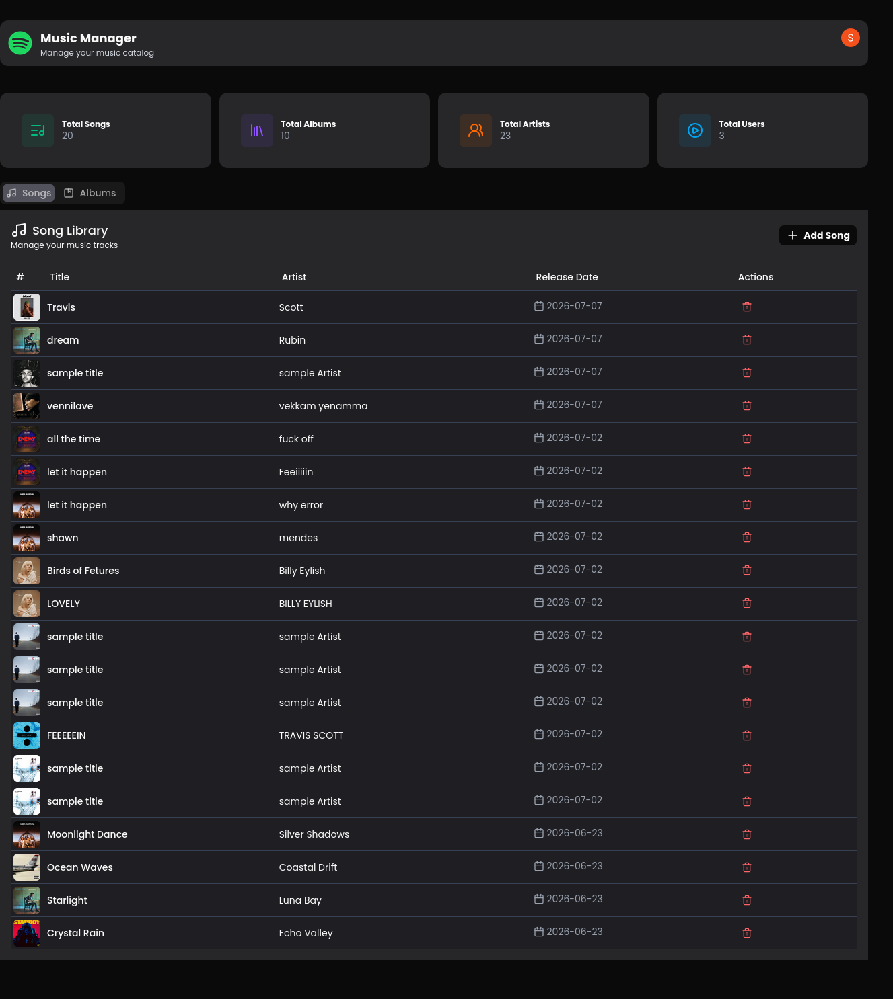
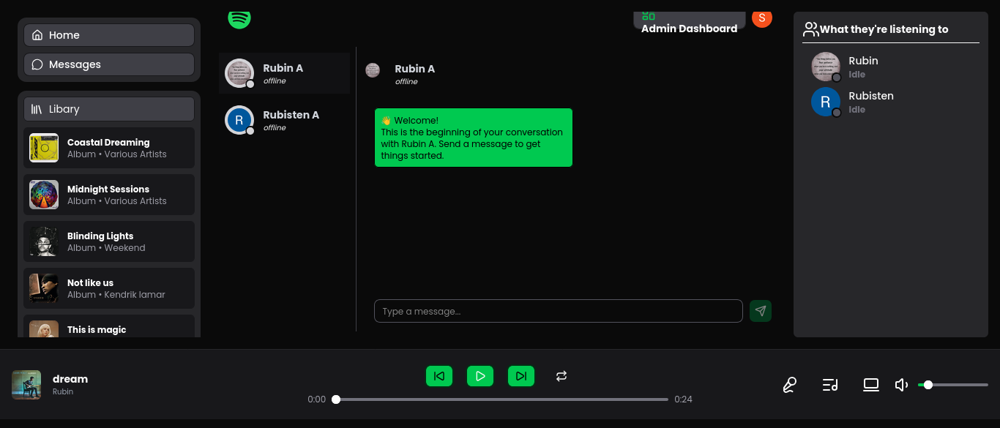
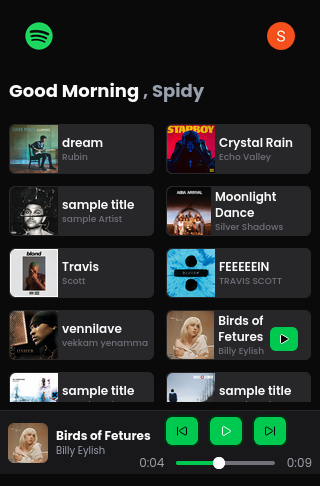
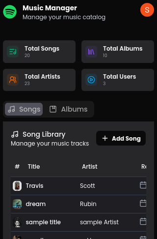
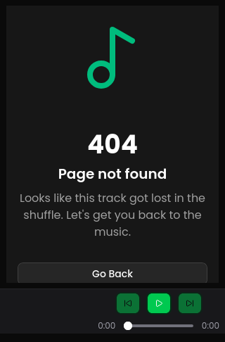
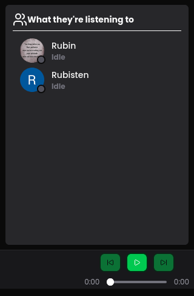

# 🎵 SoundHive — Full-Stack Spotify Clone

<div align="center">


**A full-stack, real-time music streaming app — built from scratch with the MERN stack + TypeScript.**

[](https://spotify-but-better-db3c.onrender.com/)
[](https://github.com/Rubin737/spotify-app)

[Live Demo](https://spotify-but-better-db3c.onrender.com/) · [Report Bug](https://github.com/Rubin737/spotify-app/issues) · [Request Feature](https://github.com/Rubin737/spotify-app/issues)

</div>

---

## 📖 About

SoundHive is a Spotify-inspired music streaming platform I built end-to-end — frontend, backend, auth, real-time features, and deployment. It's not a tutorial clone; every feature (audio playback engine, admin CMS, real-time chat, friend activity feed) was designed and debugged from scratch, including race conditions in Socket.io event handling, Cloudinary upload pipelines, and JWT token refresh flows with Clerk.

**🔗 Live app:** [spotify-but-better-db3c.onrender.com](https://spotify-but-better-db3c.onrender.com/)
> Hosted on Render's free tier — the backend may take 30–60s to spin up on first load.

---

## 📸 Screenshots

<div align="center">

| Home|  Sign in|
|---|---|
|  |  |

| Admin Dashboard | Real-Time Chat |
|---|---|
|  |  |

| Mobile View |
|:---:|
|  |
|  |
|  |
|  |
|  |


</div>

---

## ✨ Features

### 🎧 Core Playback
- Browse songs and albums in a Spotify-style, resizable three-panel layout (`sidebar`, `main`, `now-playing`) via shadcn/ui `ResizablePanel`
- Custom audio player — play/pause, next/previous, seek — built directly on the browser Audio API with `useRef`
- Hover-to-play song tables with responsive design across desktop, tablet, and mobile

### 🔐 Authentication
- Secure auth via [Clerk](https://clerk.com/) (`@clerk/react` v6)
- Short-lived JWTs refreshed automatically through an Axios interceptor — no manual token handling anywhere in the app

### 💬 Real-Time (Socket.io)
- Live friend activity feed — see what friends are currently listening to
- Real-time one-to-one chat between users
- Server-side presence tracking using in-memory Maps for connected sockets and user activity

### 🛠️ Admin Dashboard
- Full CRUD for songs and albums
- Cloudinary-powered audio + image uploads with automatic duration extraction from upload metadata
- Content overview stat cards

### 📱 Responsive Design
- Fully responsive layout with a dedicated mobile experience — collapsible sidebar (shadcn `Sheet`), mobile footer nav, and breakpoint-driven layout switching via Tailwind

### 🗄️ Backend
- RESTful API with Node.js + Express
- MongoDB + Mongoose data modeling
- Environment-aware CORS configuration for local + production

---

## 🧰 Tech Stack

| Layer | Technology |
|---|---|
| Frontend | React, Vite, TypeScript |
| State Management | Zustand |
| UI | shadcn/ui, Radix UI, Tailwind CSS |
| Backend | Node.js, Express |
| Database | MongoDB, Mongoose |
| Auth | Clerk (`@clerk/react` v6) |
| Real-Time | Socket.io |
| Media Storage | Cloudinary |
| Deployment | Render |

---

## 📁 Project Structure

```
spotify-app/
├── front-end/          # React + Vite + TypeScript client
│   └── src/
│       ├── components/
│       ├── pages/
│       ├── store/      # Zustand stores
│       └── ...
├── back-end/            # Node.js + Express API
│   └── src/
│       ├── controllers/
│       ├── routes/
│       ├── models/
│       └── ...
└── README.md
```

---

## 🚀 Getting Started

### Prerequisites
- Node.js (v18+)
- MongoDB Atlas account (or local MongoDB)
- Cloudinary account
- Clerk account

### 1. Clone the repo
```bash
git clone https://github.com/Rubin737/spotify-app.git
cd spotify-app
```

### 2. Backend setup
```bash
cd back-end
npm install
```

Create a `.env` file in `back-end/`:
```env
MONGODB_URI=your_mongodb_connection_string
CLOUDINARY_CLOUD_NAME=your_cloud_name
CLOUDINARY_API_KEY=your_api_key
CLOUDINARY_API_SECRET=your_api_secret
CLERK_SECRET_KEY=your_clerk_secret_key
```

```bash
npm run dev
```

### 3. Frontend setup
```bash
cd ../front-end
npm install
```

Create a `.env` file in `front-end/`:
```env
VITE_CLERK_PUBLISHABLE_KEY=your_clerk_publishable_key
VITE_API_BASE_URL=http://localhost:5000
```

```bash
npm run dev
```

---

## 🎓 What I Learned Building This

- Designing and debugging real-time systems with Socket.io — race conditions, event listener duplication, and server-side presence tracking
- Clerk's v6 auth architecture: short-lived JWTs, HttpOnly refresh cookies, and `getToken()` behavior under the hood
- Signed media uploads and `resource_type` handling with Cloudinary's SDK
- State management with Zustand, and avoiding stale closures across async operations
- Building fully responsive layouts with conditional rendering and Tailwind breakpoints instead of pure CSS media queries
- Debugging async race conditions in the browser Audio API (`AbortError`)
- Deploying a full MERN app to production — environment-aware CORS, MongoDB Atlas network access, and credential rotation

---

## 🗺️ Roadmap

- [x] Real-time friend activity (Socket.io)
- [x] Real-time chat between friends
- [x] Full mobile responsiveness
- [x] Production deployment
- [ ] Playlists and liked songs
- [ ] Search functionality
- [ ] Dark/light theme toggle

---

## 👤 Author

**Rubin**

- Portfolio: [rubinwebdev.netlify.app](https://rubinwebdev.netlify.app)
- GitHub: [@Rubin737](https://github.com/Rubin737)
- LinkedIn: [linkedin.com/in/rubisten](https://linkedin.com/in/rubisten/)

---

## 📄 License

This project is for personal/portfolio use.